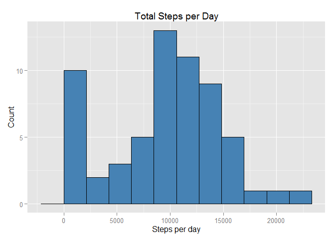
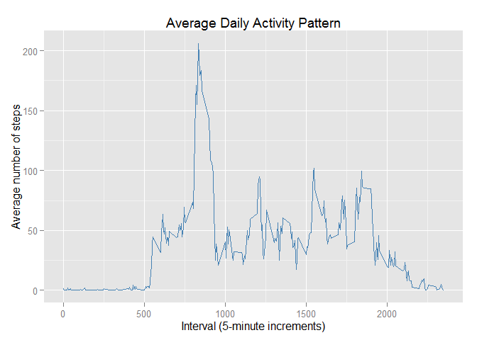
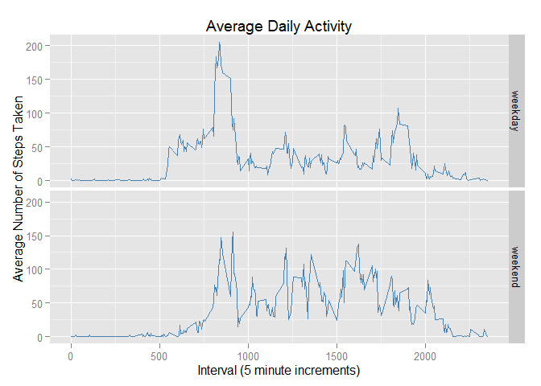

# Reproducible Research: Peer Assessment 1

## Loading required packages
Load dplyr for handling data, and ggplot2 for creating graphs.
Set inline R code output options.

```r
require(dplyr)
```

```
## Loading required package: dplyr
## 
## Attaching package: 'dplyr'
## 
## The following objects are masked from 'package:stats':
## 
##     filter, lag
## 
## The following objects are masked from 'package:base':
## 
##     intersect, setdiff, setequal, union
```

```r
require(ggplot2)
```

```
## Loading required package: ggplot2
```

```r
options(scipen = 1, digits = 2)
```
## Loading and preprocessing the data

```r
# Load the data
data <- read.csv(unzip("activity.zip", "activity.csv"))

# Process/transform the data
data$date <- as.Date(data$date)
```


## What is mean total number of steps taken per day?

```r
# Calculate the total number of steps taken per day
by.date <- group_by(data, date)
day.sums <- summarize(by.date, t.steps = sum(steps, na.rm = TRUE))

# Make a histogram of the total number of steps taken each day.
ggplot(data = day.sums, aes(t.steps)) + 
  geom_histogram(binwidth = (max(day.sums$t.steps) / 10), 
                 col = "black", 
                 fill = "steelblue") +
  labs(title = "Total Steps per Day") +
  labs(x = "Steps per day", y = "Count")
```

 

```r
# Calculate and report the mean and median of the total number of steps taken per day
steps.mean <- mean(day.sums$t.steps)
steps.med <- median(day.sums$t.steps)
```
The mean number of steps per day is: 9354.23.

The median numer of steps per day is: 10395.


## What is the average daily activity pattern?

```r
# Make a time series plot of the 5-minute interval and the average number of steps taken, averaged across all days
by.interval <- group_by(data, interval)
interval.avg <- summarize(by.interval, avg.steps = mean(steps, na.rm = TRUE))
ggplot(data = interval.avg, aes(x = interval, y = avg.steps)) + 
  geom_line(col = "steelblue") +
  labs(title = "Average Daily Activity Pattern") +
  labs(x = "Interval (5-minute increments)", y = "Average number of steps")
```

 

```r
# Which 5-minute interval, on average across all the days in the dataset, contains the maximum number or steps?
max.int <- which(interval.avg$avg.steps == max(interval.avg$avg.steps, na.rm = TRUE))
```
The 5-minute interval which contained the most number of steps on average was the interval from 835 to 840 minutes.

## Imputing missing values

```r
# Calculate and report the total number of missing values in the dataset
missing.vals <- sum(!complete.cases(data))
```
There were a total of 2304 incomplete cases in the activity dataset.

### Strategy for filling in all of the missing values in the dataset
An obvious method to replace missing values is to take the median value for that interval, and use it to replace the missing value, as this will give a fairly good idea of what the data might have been.

```r
# Create a new dataset that is equal to the original dataset but with the missing data filled in
int.meds <- summarize(by.interval, median = median(steps, na.rm = TRUE))
new.data <- data
for(i in 1:nrow(new.data)) {
    if(is.na(new.data[i, "steps"])){
        miss.int <- new.data[i, "interval"]
        new.data[i, "steps"] <- int.meds[which(int.meds$interval == miss.int), "median"]
    } else{
        next()
    }
}

#Make a histogram of the total number of steps taken each day and calculate and report the mean and median total number of steps taken per day. Do these values differ from the estimates from the first part of the assignment? What is the impact of imputting missing data on the estimates of the total daily number of steps?
# Calculate the total number of steps taken per day
new.by.date <- group_by(new.data, date)
new.day.sums <- summarize(new.by.date, t.steps = sum(steps, na.rm = TRUE))

# Make a histogram of the total number of steps taken each day.
ggplot(data = new.day.sums, aes(t.steps)) + 
  geom_histogram(binwidth = (max(new.day.sums$t.steps) / 10), 
                 col = "black", 
                 fill = "steelblue") +
  labs(title = "Total Steps per Day") +
  labs(x = "Steps per day", y = "Count")
```

 

```r
new.steps.mean <- mean(new.day.sums$t.steps)
new.steps.med <- median(new.day.sums$t.steps)
```
The new mean number of steps per day is: 9503.87.

The new median numer of steps per day is: 10395.

The new mean number of steps taken per day is 149.64 steps less than the original mean, while the median stayed the same, which is unsurprising as the median values for each interval were used to replace missing data, so the "center" would have remained roughly the same.


## Are there differences in activity patterns between weekdays and weekends?

```r
# Create a new factor variable in the dataset with two levels -- "weekday" and "weekend" indicating whether a given date is a weekday or weekend day.

day.data <- mutate(new.data, day = factor(weekdays(new.data$date)), day.cat = factor("weekday", levels = c("weekday", "weekend")))
for(i in 1:nrow(day.data)){
    if(day.data[i, "day"] == "Saturday" || day.data[i, "day"] == "Sunday"){
        day.data[i, "day.cat"] <- "weekend"
    } else {
      next()
    }
}

# Make a panel plot containing a time series plot of the 5-minute interval and the average number of steps taken, averaged across all weekday days or weekend days
new.by.interval <- group_by(day.data, interval)
new.interval.avg <- summarize(new.by.interval, avg.steps = mean(steps, na.rm = TRUE))

ggplot(data = new.interval.avg, aes(x = interval, y = avg.steps)) + 
  geom_line(col = "steelblue")
```

 
